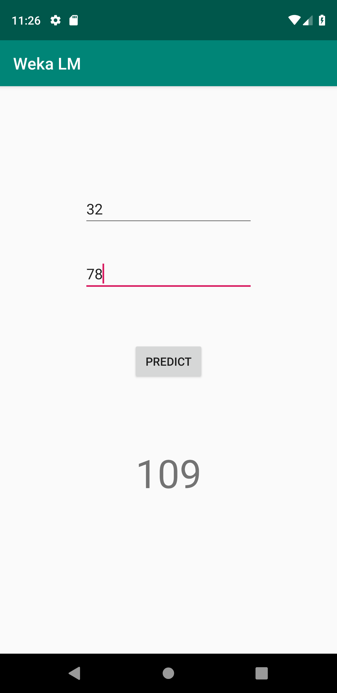

# Embed a Machine Learning Model in an Android Application

This is a simple linear regression model built with the java weka api and embedded in an android application.

Folders:
- data: include fake data
- WekaLM: android application
- WekaKMJavaModel: linear regression model trained using the java weka api

 
